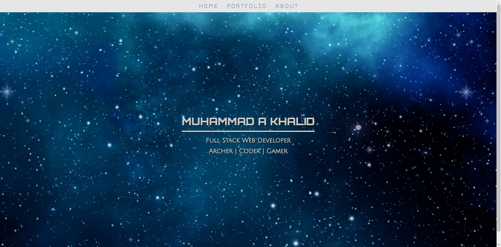
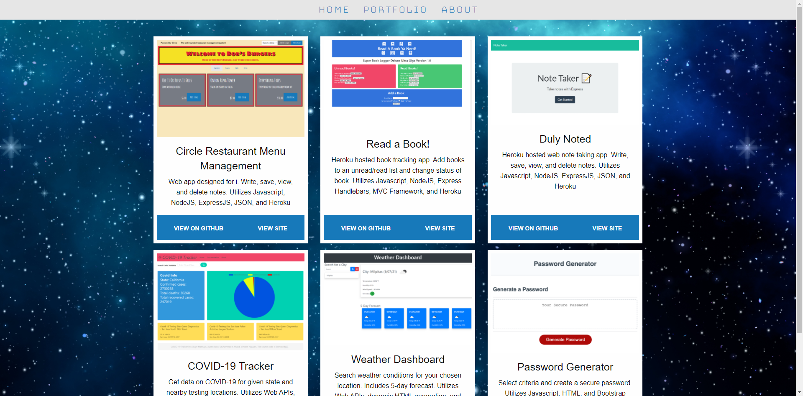
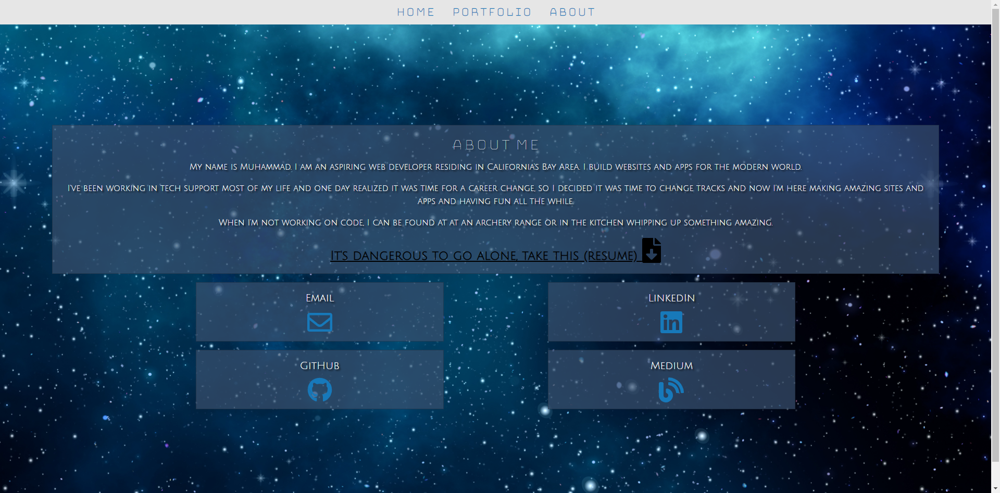

# Folio 3



-----------------------
## Table of Contents
1. [Description](#description)
2. [Deployed Link](#deployed-link)
3. [Code Snippet](#code-snippet)
4. [Prerequisites](#prerequisites)
5. [Built with](#built-with)
6. [Licenses](#licenses)
7. [Author](#author)
8. [Acknowledgements](#acknowledgements)

-----------------------
## Description
A new responsive portfolio utilizing Express JS for path redirection. I really like space aand sci-fi so I wanted bring the magic and feel of the cosmos to my portfolio.

-----------------------
## Deployed Link https://mak-folio.herokuapp.com/

-----------------------


-----------------------
## Code Snippet

Having played with both Bootstrap and Bulma CSS Frameworks, I decided it was time to try something a bit more complex with Foundation CSS. Unlike Bulma, which has no Javascript/jQuery, Foundation does and this took me quite some time to get used to as I like having full control of what's happening in my code. Because of this implementing Foundation is not as straightforward. You will need the following snippets of code.

In the head tag you need:
```html
<link rel="stylesheet" href="https://cdn.jsdelivr.net/npm/foundation-sites@6.6.3/dist/css/foundation.min.css"
	integrity="sha256-ogmFxjqiTMnZhxCqVmcqTvjfe1Y/ec4WaRj/aQPvn+I=" crossorigin="anonymous">
<script src="https://cdn.jsdelivr.net/npm/foundation-sites@6.6.3/dist/js/foundation.min.js"
	integrity="sha256-pRF3zifJRA9jXGv++b06qwtSqX1byFQOLjqa2PTEb2o=" crossorigin="anonymous"></script>
```

And at the bottom of the body tag you need:
```html
<script>
	$(document).ready(function () {
		$(document).foundation();
	});
</script>
```


-----------------------
## Prerequisites
A computer with an active internet connection and a web browser

-----------------------
## Built with
- Express JS
- Heroku
- Foundation CSS
- jQuery
- Javascript
- HTML
- CSS
- Git
- Github

-----------------------
## Licenses
This Project is licensed under MIT license

-----------------------
## Author
Muhammad A Khalid

[LinkedIn](https://www.linkedin.com/in/abdullahkhalid/)
<br>
[GitHub](https://github.com/akhalid88)

-----------------------
## Acknowledgements
- Jerome Chenette (Instructor)
- Manuel Nunes (TA)
- Mahisha Manikandan (TA)
- UC Berkeley Coding Bootcamp